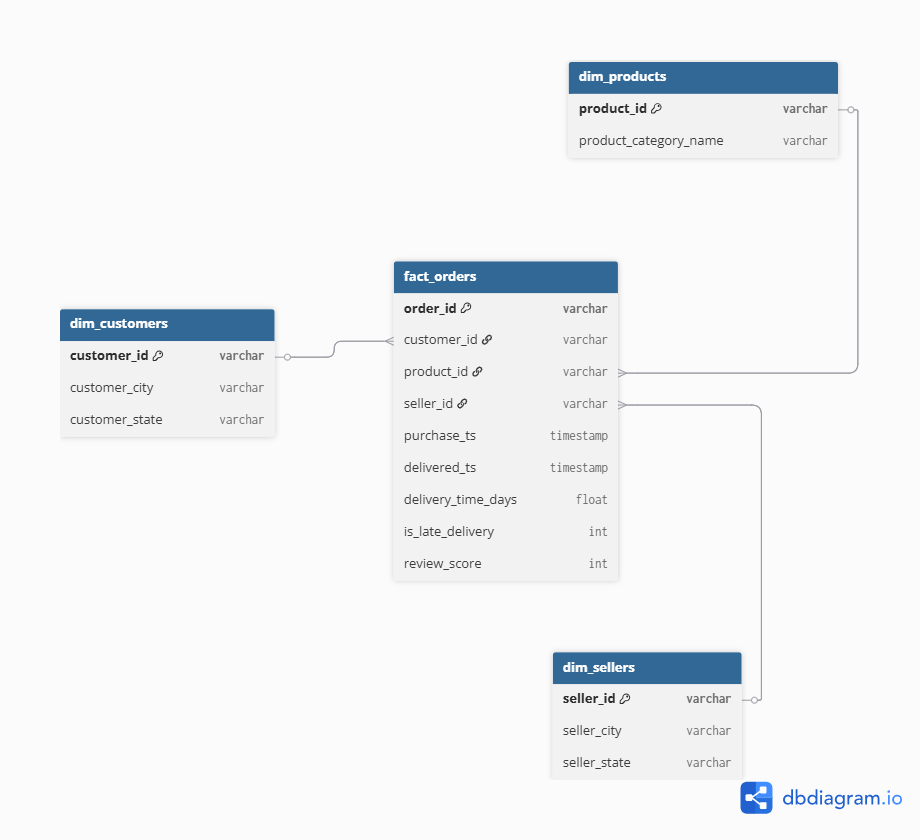

# Data Architecture Overview

This project implements a Medallion Architecture (Bronze → Silver → Gold) using PostgreSQL to simulate a production-grade data warehouse for an e-commerce platform.

# Architecture Layers

## 1. Bronze Layer (Raw Data)
- This is raw data ingested from CSV sources into PostgreSQL using DBeaver import functionality
- There were no transformations applied or any cleaning of data
- This layer serves as the single source of truth for downstream processing

## 2. Silver Layer (Cleaned Data)
- Data cleaning and standardisation is applied using SQL transformations
- The tasks include:
  - Removing duplicates
  - Handling NULL values
  - Standardising text fields
  - Converting timestamps and data types
- This layer produces analytical ready intermediate datasets

## 3. Gold Layer (Business Layer)
- The star schema is designed for analytics and reporting
- Contains:
  - Fact table: fact_orders
  - Dimension tables: dim_customers, dim_products and dim_sellers
- This layer is optimised for querying, dashboards, and business insights

## Data Flow

Bronze -> Silver -> Gold -> Analytics & Reporting

## ER Diagram

The diagram was done using dbdiagram.io

## Objective
To demonstrate end-to-end data engineering capabilities including ingestion, transformation, modelling, and analytical ready data design.